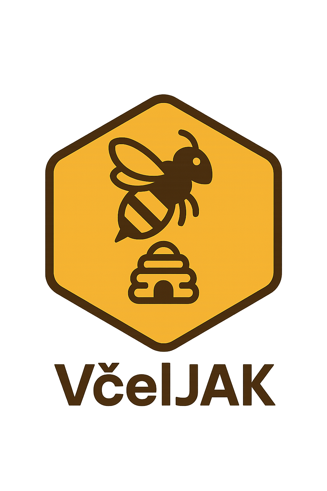

# VčelJAK

  

VčelJAK (Včely? a JAK jsou na tom včely?) je projekt zaměřený na monitorování včelích úlů. Projekt integruje jak specializovanou hardwarovou část pro sběr dat přímo z úlů, tak softwarové řešení pro zpracování, ukládání, analýzu a vizualizaci těchto dat.

Cílem projektu je poskytnout včelařům moderní nástroj pro detailní sledování stavu a podmínek ve včelstvech, což umožňuje lepší péči a optimalizaci včelařských postupů.

## Komponenty Projektu

Projekt VčelJAK se skládá ze dvou hlavních částí:

### 1. Hardwarová Část

Hardwarová část je zodpovědná za sběr dat přímo z prostředí včelích úlů. Zahrnuje:

*   **Hardwarové Huby:** Centrální jednotky umístěné u včelstev, které shromažďují data z připojených senzorů. Tyto huby zajišťují komunikaci se serverovou částí.
*   **Senzory:** Různé typy senzorů (např. BMX280 pro teplotu, vlhkost a tlak; HX711 pro měření hmotnosti úlu) připojené k hardwarovým hubům. Tyto senzory měří klíčové veličiny vypovídající o stavu včelstva a okolního prostředí.

*(Poznámka: Hardwarové část je ve vývoji, v nejbližší době bude zveřejněna)*

### 2. Serverová Část (Tento Repozitář)

Serverová část tvoří mozek celého systému. Zajišťuje:

*   **Příjem a Zpracování Dat:** Přijímá data odesílaná z hardwarových hubů.
*   **Ukládání Dat:** Využívá specializované databáze (PostgreSQL pro relační data a metadata, InfluxDB pro časové řady senzorických měření, Redis pro caching a dočasná data) pro efektivní uložení velkého objemu informací.
*   **Analýza a Vizualizace:** Poskytuje nástroje pro analýzu nasbíraných dat a jejich přehlednou vizualizaci prostřednictvím webového uživatelského rozhraní.
*   **Uživatelské Rozhraní:** Moderní webová aplikace (postavená na Next.js) umožňující včelařům sledovat grafy, dashboardy a spravovat systém.
*   **API Rozhraní:** Poskytuje API pro komunikaci mezi hardwarovými huby a frontendovou aplikací.

Pro detailní informace o architektuře, použitých technologiích, instalaci a konfiguraci serverové části navštivte:
**[README Serverové Části](Server/readme.md)**

## Cíle Projektu

*   Poskytnout studentům platformu pro praktické uplatnění znalostí v oblasti elektroniky, programování a datové analýzy.
*   Vytvořit funkční a užitečný nástroj pro včelaře.
*   Zvýšit povědomí o důležitosti včel a moderních technologií v zemědělství.

Tento projekt vznikl jako studentská práce na Gymnáziu Jana Amose Komenského.
