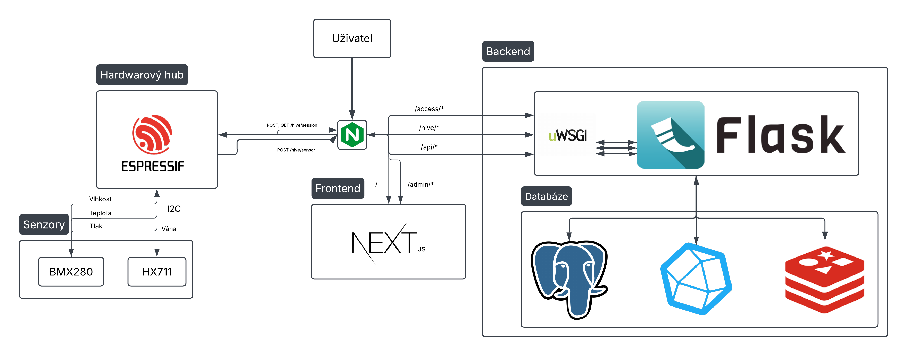

# VcelJAK - Serverová Část

VcelJAK je systém pro monitorování včelstev. Tato dokumentace popisuje serverovou část systému, která zajišťuje centralizované zpracování, ukládání a vizualizaci dat. Slouží jako komunikační rozhraní mezi hardwarovými huby umístěnými u včelstev a uživatelským rozhraním. Server provádí analýzu a zpracování získaných dat a podporuje funkce od autentizace a správy relací až po zobrazení grafů a dashboardů, které poskytují včelaři komplexní přehled o stavu jednotlivých úlů.

## Architektura Systému

Serverová část je navržena jako sada kontejnerizovaných služeb. Níže je stručný přehled hlavních komponent:

*   **Uživatel (Uživatel):** Koncový uživatel interagující se systémem prostřednictvím webového rozhraní.
*   **Nginx:** Webový server a reverzní proxy, který zpracovává příchozí požadavky, servíruje frontendovou aplikaci a směruje požadavky na backendové API.
*   **Frontend (Next.js):** Moderní webová aplikace postavená na Next.js, která poskytuje uživatelské rozhraní pro vizualizaci dat a správu systému.
*   **Backend (Flask):** API server postavený na Python frameworku Flask, který obsluhuje logiku aplikace, zpracovává data z hardwarových hubů a komunikuje s databázemi. Běží za uWSGI serverem.
*   **Databáze:**
    *   **PostgreSQL:** Primární relační databáze pro ukládání metadat o uživatelích, hubech, včelstvech, konfiguracích a relačních datech.
    *   **InfluxDB:** Časově-řadová databáze optimalizovaná pro ukládání a dotazování velkých objemů měřených dat ze senzorů.
    *   **Memcached:** In-memory databáze používaná pro caching a ukládání dočasných dat, například pro rate limiting.
*   **Hardwarový hub (Hardwarový hub):** Zařízení umístěné u včelstev, které sbírá data z připojených senzorů a odesílá je na server.
*   **Senzory (Senzory):** Zařízení jako BMX280, HX711 připojená k hardwarovému hubu, měřící různé veličiny (teplota, vlhkost, hmotnost atd.).



## Použité Technologie

*   **Backend:** Python, Flask, SQLAlchemy
*   **Frontend:** Next.js, TypeScript, React, Shadcn UI, TailwindCSS, NextAuth
*   **Databáze:** PostgreSQL, InfluxDB, Memcached
*   **Web Server / Proxy:** Nginx
*   **WSGI Server:** uWSGI
*   **Kontejnerizace:** Docker, Docker Compose

## Důležité Upozornění pro Nasazení (Deployment)

⚠️ **Stav konfigurace:** Aktuální konfigurace Nginx a Next.js (včetně HTTPS) je ve **vývojové/alfa verzi**. Jsou přiloženy **lokální (self-signed) certifikáty** pro testovací účely.

**Pro produkční nasazení je nezbytně nutné:**

1.  **Vyměnit lokální certifikáty** za platné certifikáty vydané certifikační autoritou (CA).
2.  **Upravit konfiguraci Nginx** (`nginx.conf` nebo příslušné konfigurační soubory) tak, aby odpovídala vašemu produkčnímu prostředí a používala nové certifikáty. To může zahrnovat změny v cestách k certifikátům, nastavení server_name a další direktivy specifické pro produkci.
3.  **Pečlivě zkontrolovat a upravit všechny relevantní environmentální proměnné** generované `install.sh` (v souboru `.env`), zejména:
    *   `NEXT_PUBLIC_WEBSITE_URL` a `NEXTAUTH_URL` na skutečnou veřejnou doménu.
    *   `NODE_TLS_REJECT_UNAUTHORIZED=1` pro Next.js v produkci, aby se vynutilo ověřování TLS certifikátů.
    *   Všechny hesla a tajné klíče, aby byla zajištěna jejich dostatečná síla a unikátnost pro produkční prostředí.
    *   Ostatní konfigurační proměnné dle potřeb produkčního nasazení.
4. **Zkontrolovat základní konfigurační soubor Flasku**
   Toto není v produkční verzy vyžadováno, ale doporučuje se.

Použití výchozí konfigurace s lokálními certifikáty v produkčním prostředí představuje **významné bezpečnostní riziko**.

## Instalace a Spuštění

Serverová část je navržena pro spuštění pomocí Dockeru a Docker Compose. Pro usnadnění instalace je k dispozici skript `install.sh`.

### Předpoklady

*   Nainstalovaný `git`.
*   Nainstalovaný `openssl` (pro generování tajných klíčů).
*   Nainstalovaný Docker: [https://docs.docker.com/get-docker/](https://docs.docker.com/get-docker/)
*   Nainstalovaný Docker Compose (buď jako `docker-compose` nebo `docker compose` plugin): [https://docs.docker.com/compose/install/](https://docs.docker.com/compose/install/)

### Kroky Instalace a Prvního Spuštění

1.  **Spuštění instalačního skriptu:**
    Otevřete terminál a spusťte skript `install.sh` z kořenového adresáře, kam chcete projekt naklonovat (nebo kde již je naklonován).
    ```bash
    ./install.sh
    ```
    Tento skript provede následující kroky:
    *   Zkontroluje přítomnost `git` a `openssl`.
    *   Naklonuje repozitář `VcelJAK` z GitHubu do adresáře `VcelJAK_project` (pokud již neexistuje).
    *   Vytvoří (pokud neexistuje) soubor `.env` v adresáři `VcelJAK_project/Server/Server/`. Během tohoto procesu budete vyzváni k zadání hesel pro databáze a administrátorský účet webové stránky. Ostatní konfigurační hodnoty a tajné klíče budou vygenerovány automaticky nebo nastaveny na výchozí hodnoty.
    *   Vytvoří spustitelný skript `start.sh` v adresáři `VcelJAK_project/Server/Server/`.

2.  **Kontrola a Úprava Konfigurace (Důležité!):**
    Před prvním spuštěním **důrazně doporučujeme** zkontrolovat a případně upravit vygenerovaný konfigurační soubor:
    `VcelJAK_project/Server/Server/.env`
    Zkontrolujte zejména:
    *   Hesla (zadaná během instalace).
    *   Automaticky generované tajné klíče.
    *   Výchozí hodnoty jako `FLASK_DEBUG`, `SYSTEM_VERSION`, `API_VERSION`, `NEXT_PUBLIC_WEBSITE_URL`, `NEXTAUTH_URL`, a zejména `NODE_TLS_REJECT_UNAUTHORIZED` (pro produkci by měl být `1`).
    *   Viz sekce **Důležité Upozornění pro Nasazení (Deployment)** výše.
    *   Základní konfigruaci flasku. Ve které se nachazí další hondoty, které server používá.
   `VcelJAK_project/Server/Server/flask/default_config.json`
3.  **Navigace do adresáře se službami:**
    ```bash
    cd VcelJAK_project/Server/Server
    ```

4.  **Spuštění Aplikace:**
    Spusťte aplikaci pomocí vygenerovaného skriptu `start.sh`:
    ```bash
    ./start.sh
    ```
    Tento skript použije soubor `docker-compose.yml` (nebo `.yaml`) a `.env` k sestavení (pokud je to nutné) a spuštění všech Docker kontejnerů v detached módu (`-d`).

5.  **Ověření stavu a logů:**
    *   Stav kontejnerů: `docker-compose ps` (nebo `docker compose ps`)
    *   Logy konkrétní služby (např. `backend`): `docker-compose logs -f backend`

### Zastavení Aplikace

Pro zastavení běžících služeb použijte v adresáři `VcelJAK_project/Server/Server/` příkaz:
```bash
docker-compose down
 ```

(nebo docker compose down, v závislosti na vaší verzi Docker Compose)

## Struktura Projektu / Komponenty

Frontend: Zajišťuje vizuální rozhraní pro uživatele. Podrobnosti viz Dokumentace Frontendu.

Backend: Poskytuje API pro komunikaci s frontendem a hardwarovými huby, zpracovává data a spravuje databáze. Podrobnosti viz Dokumentace Backend API.

Databáze: Ukládají veškerá persistentní data systému. Podrobnosti viz Popis Databází.

Komunikace s HW Hubem: Definuje, jak hardwarové huby komunikují se serverem. Podrobnosti viz Integrace Hardwarového Hubu.

## Podrobná Dokumentace (Wiki)

Pro detailnější informace o jednotlivých částech serveru prosím navštivte následující dokumenty:

*   **[Dokumentace Frontendu](FRONTEND.md):** Popis frontendové aplikace, jejích stránek a funkcí.
*   **[Dokumentace Backend API](BACKEND_API.md):** Detailní specifikace API endpointů poskytovaných backendem.
*   **[Popis Databází](DATABAZE.md):** Informace o použitých databázích, jejich strukturách a účelu.
*   **[Integrace Hardwarového Hubu](HW_HUB_INTEGRACE.md):** Průvodce pro integraci hardwarových hubů se serverem.
